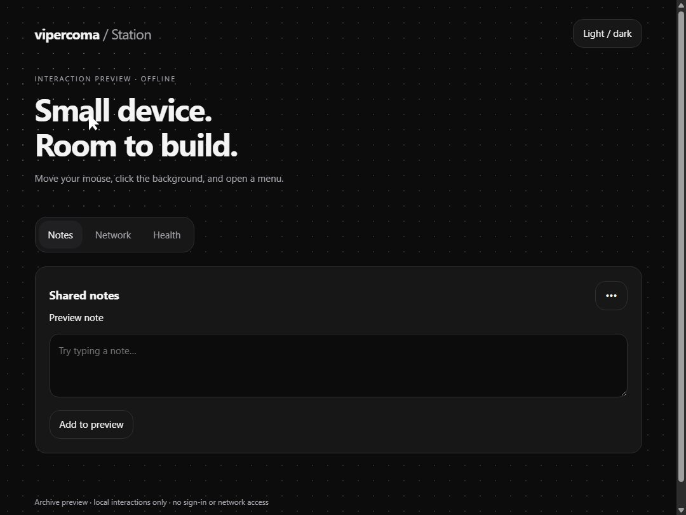

# vipercoma Station

[](docs/previews/station-interaction-preview.mp4)

**[Watch the interface preview](docs/previews/station-interaction-preview.mp4)** · Design preview of the dashboard interactions.

A local workspace for a Raspberry Pi or Linux computer. Version **2.2.0-wifi** adds an optional boot-time Wi-Fi setup hotspot while preserving Station sign-in, notes, diagnostics, and device health. The authenticated home page is a yellow launcher dashboard with a reactive dotted background, live device readings, and Overview, Tool Catalog, Activity, and System tabs.

## Boot and Wi-Fi onboarding

At boot, the setup service allows NetworkManager up to 50 seconds to connect, then scans visible saved auto-connect Wi-Fi profiles and attempts them strongest-signal first. Signal is a scan-time snapshot and can vary with the Pi's radio/driver. If no saved profile connects, it enables the secured `vipercoma-setup` hotspot. Connect your phone to that network and open `http://10.77.0.1:8080/setup` (or use the phone's captive-network prompt). Sign in with your **Station password**, choose the home/mobile Wi-Fi network, and enter that network's password.

When the Pi joins the selected network, it leaves the setup hotspot. Join that same network from your phone and open `http://pihole.local:8080`, or use the Pi's LAN address if `.local` names are unavailable. This local connection does not require Tailscale. Tailscale reconnects through its own installed service when the selected Wi-Fi has internet; Station does not install, reconfigure, or require Tailscale. If the Wi-Fi connection fails, the Pi restores the setup hotspot. One built-in radio operates in hotspot or normal Wi-Fi mode; this does not provide simultaneous access point and client mode or internet sharing.

The setup hotspot password is entered once during installation. The hotspot password, Station sign-in password, and normal Wi-Fi password are separate credentials. They can have the same value if you choose, but the application never copies one into another. The WebUI stores only a hash of the Station password. NetworkManager stores saved Wi-Fi credentials in root-owned profiles outside the repository.

Wi-Fi setup supports visible personal-security and open networks. Enterprise and WEP networks are identified as unsupported. The local setup hotspot provides DHCP and captive-page DNS only; it has no internet gateway.

## Install

Target: Raspberry Pi OS/Debian Linux with systemd, Python 3.12 or 3.13, NetworkManager, `python3-venv`, and (for the optional setup hotspot) `dnsmasq`.

From a user-owned project checkout:

```bash
sudo bash scripts/install.sh
sudo bash scripts/install-wifi.sh
```

The first command installs Station and asks for the Station sign-in password if one is not already configured. The second checks prerequisites and tests, then asks for a separate hotspot password. If `vipercoma-wifi.service` is already active, the app installer stops for a manual review of that existing Wi-Fi setup instead of replacing it. It does not remove saved networks or change firewall rules. It stops before installing if another service owns DNS port 53. Keep a known recovery path to the Pi before enabling Wi-Fi fallback.

Without Wi-Fi setup enabled, Station stays on the host's existing network. Open `http://pihole.local:8080` or the current LAN address and sign in with the Station password.

## Tools

| Tool | What it does |
| --- | --- |
| Shared notes | Persist up to 200 notes, each up to 4000 characters |
| Network diagnostics | Read addresses, routes, neighbor cache, DNS, and latency |
| Device health | Show RAM, storage, uptime, temperature, and load |

The dashboard links to those implemented tools. Activity history is not persistent yet; its tab reports the current session and makes that limitation clear. The launcher artwork's Audit Center, Pwnagotchi Audit, File Hub, Automation Flows, CyberChef, and PiKVM cards are design examples, not installed or working tools in this release.

The Wi-Fi setup page is a separate, authenticated system feature. It is not a general-purpose network-control tool. No traffic blocking, gateway manipulation, password capture, or internet forwarding is implemented.

## Change the Station password

Run as the service user from the project directory:

```bash
STATION_STATE_DIR=/var/lib/vipercoma-workspace .venv/bin/python auth.py --set-password
sudo systemctl restart vipercoma-workspace.service
```

Input is hidden and stored as a salted hash. Changing it rotates the session key.

## Update

After the corresponding GitHub checks pass, update from the Pi:

```bash
cd ~/vipercoma-station
git status --short
bash scripts/update.sh
```

The updater fast-forwards the checkout and runs the installer/tests. Keep local changes committed or backed up before updating. Wi-Fi helper services and profiles are installed separately and remain in place during Station application updates.

## Validation

```bash
.venv/bin/python -W always::ResourceWarning -m unittest discover -s tests -v
node --check static/station.js
node --check static/wifi-setup.js
bash -n scripts/install.sh scripts/install-wifi.sh scripts/update.sh
```

Automated checks cannot validate the Pi's radio mode, DHCP lease, phone captive prompt, boot behavior, or RAM use. Verify those on the actual Pi with a known way to reconnect. Keep the existing saved Wi-Fi profile and recovery notes.

## Private runtime data

Production data lives in `/var/lib/vipercoma-workspace`, outside the source checkout. Do not publish runtime directories, NetworkManager profiles, passwords, session keys, databases, or recovery archives. Station uses local HTTP with authenticated sessions and CSRF checks; keep it on a trusted private network and do not expose port 8080 to the public internet.
